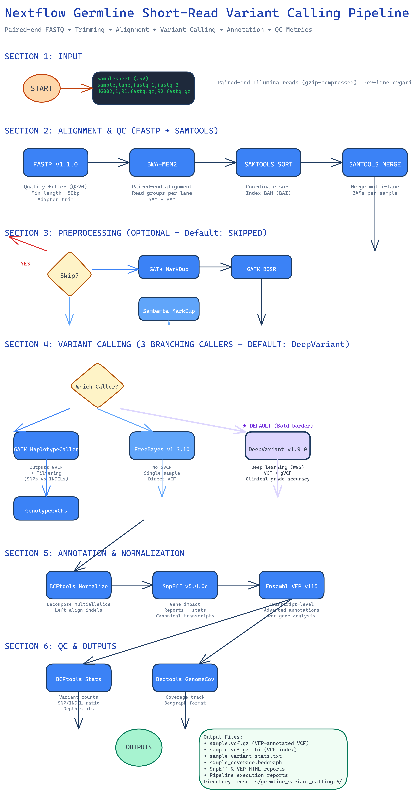

# Nextflow Short Reads Germline Variant Calling

This repository implements a comprehensive Nextflow pipeline for germline short-read variant calling, supporting multiple variant callers (DeepVariant, GATK HaplotypeCaller, FreeBayes) with integrated quality control and annotation.

## Pipeline Architecture



For a detailed breakdown of the pipeline architecture, tool versions, parameters, and usage examples, see [PIPELINE_ARCHITECTURE.md](docs/PIPELINE_ARCHITECTURE.md).

## Quick Start

```bash
pixi run nextflow run main.nf -profile docker,test -resume 
```

## Key Features

- **Multiple Variant Callers**: DeepVariant (default), GATK HaplotypeCaller, FreeBayes
- **Quality Control**: FastQC, MultiQC, samtools stats
- **Variant Annotation**: SnpEff, VEP
- **Structural Variants**: Manta SV calling (with benchmarking support)
- **Flexible Configuration**: Container support (Docker/Singularity), multiple profiles
- **Benchmarking Tools**: Integrated Truvari for SV benchmarking

## Documentation

- [Pipeline Architecture](docs/PIPELINE_ARCHITECTURE.md) - Detailed documentation with tool versions and parameters
- [Benchmarking Guide](benchmark/Readme.md) - SV and SNP/INDEL benchmarking instructions