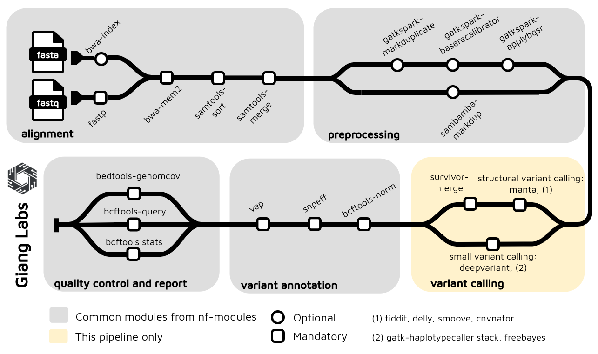

# Nextflow Germline Short-Read Variant Calling

This repository implements a comprehensive Nextflow pipeline for germline short-read variant calling, supporting multiple variant callers (DeepVariant, GATK HaplotypeCaller, FreeBayes) with integrated quality control and annotation.

## Pipeline Architecture



For a detailed breakdown of the pipeline architecture, tool versions, parameters, and usage examples, see [architecture.md](docs/architecture.md).

## Primary Use Case

**Primary support**: **30X whole-genome sequencing (WGS) Illumina short reads with GRCh38 (hg38) alignment**

The pipeline is optimized for the following workflow:

- **Input**: Illumina short-read FASTQ files (~30X coverage)
- **Quality Control**: FASTP for read-level quality filtering
- **Alignment**: BWA-MEM2 alignment to GRCh38 (hg38) reference genome
- **Preprocessing**: Skipped by default (can be enabled if needed)
- **Variant Calling**: **DeepVariant** (default) for high-accuracy germline variant detection
- **Quality Reports**:
  - Alignment quality metrics (samtools stats, FastQC, MultiQC)
  - Variant call quality reports
- **Variant Annotation**:
  - **SnpEff** (annotation database)
  - **VEP** (Ensembl Variant Effect Predictor)
- **Output**: Annotated VCF files with comprehensive quality metrics

### SNP and INDEL Benchmarking Performance

This pipeline is specifically optimized for **SNP and small INDEL detection** using **DeepVariant**. Benchmark results against HG002 (Genome in a Bottle) demonstrate competitive performance with nf-core/sarek:

#### SNP Detection Performance (HG002 - DeepVariant)

| Pipeline               | Recall | Precision | F1 Score | TP        | FN     |
| ---------------------- | ------ | --------- | -------- | --------- | ------ |
| nf-germline-short-read | 99.39% | 99.82%    | 99.60%   | 3,344,672 | 20,455 |
| nf-core/sarek          | 99.39% | 99.84%    | 99.61%   | 3,344,549 | 20,578 |

#### INDEL Detection Performance (HG002 - DeepVariant)

| Pipeline               | Recall | Precision | F1 Score | TP      | FN    |
| ---------------------- | ------ | --------- | -------- | ------- | ----- |
| nf-germline-short-read | 98.78% | 99.38%    | 99.08%   | 519,079 | 6,390 |
| nf-core/sarek          | 98.97% | 99.46%    | 99.21%   | 520,048 | 5,421 |

**Key Results**: Both pipelines achieve excellent SNP and INDEL accuracy with DeepVariant. nf-germline-short-read performs comparably to nf-core/sarek while maintaining a **simpler, streamlined workflow** optimized specifically for germline variant calling.

### Configuration for Primary Use Case

```bash
# Default configuration uses:
# - DeepVariant as variant caller
# - HG38/GRCh38 reference genome
# - FASTP quality filtering
# - Preprocessing skipped (skip_preprocessing: true)
# - SnpEff + VEP annotation enabled

pixi run nextflow run main.nf -profile docker -resume
```

## Quick Start

### 1. Prepare a Samplesheet

Create a CSV samplesheet with your input. The pipeline supports three input modes:

#### Mode A: FASTQ Input (Full Pipeline)

```csv
sample,lane,fastq_1,fastq_2
HG002,L001,/path/to/HG002_R1.fastq.gz,/path/to/HG002_R2.fastq.gz
HG003,L001,/path/to/HG003_R1.fastq.gz,/path/to/HG003_R2.fastq.gz
```

#### Mode B: BAM Input (Skip Alignment)

```csv
sample,lane,bam,bai
HG002,L001,/path/to/HG002.bam,/path/to/HG002.bam.bai
HG003,L001,/path/to/HG003.bam,/path/to/HG003.bam.bai
```

#### Mode C: CRAM Input (Skip Alignment + Auto-Convert)

```csv
sample,lane,cram,crai
HG002,L001,/path/to/HG002.cram,/path/to/HG002.cram.crai
HG003,L001,/path/to/HG003.cram,/path/to/HG003.cram.crai
```

**CRAM Benefits**:

- **Compressed input**: CRAM files are ~4x smaller than BAM (78% compression)
- **Faster pipeline**: Skip alignment step when re-running variant calling
- **Automatic conversion**: CRAM→BAM conversion integrated into pipeline
- **Supported for all callers**: DeepVariant, GATK, FreeBayes, and all SV callers (Manta, Delly, TIDDIT, LUMPY, CNVnator)

**Samplesheet Columns**:

- `sample`: Sample identifier
- `lane`: Sequencing lane (if multiple lanes, create separate rows per lane)
- **FASTQ mode**: `fastq_1`, `fastq_2` (gzipped FASTQ files)
- **BAM mode**: `bam`, `bai` (aligned BAM + index)
- **CRAM mode**: `cram`, `crai` (compressed alignment + index)

### 2. Run the Pipeline

#### Standard Run (FASTQ Input)

```bash
nextflow run main.nf \
  --input samplesheet.csv \
  --profile docker \
  -resume
```

#### CRAM Input Example

```bash
# Run with CRAM files (auto-converts to BAM before variant calling)
nextflow run main.nf \
  --input samplesheet_cram.csv \
  --profile docker \
  -resume
```

#### Advanced Options

```bash
# With multiple SV callers
nextflow run main.nf \
  --input samplesheet_cram.csv \
  --structural_variant_caller "manta,delly,lumpy" \
  --profile docker \
  -resume

# Skip annotation for faster processing
nextflow run main.nf \
  --input samplesheet.csv \
  --skip_annotation \
  --profile docker \
  -resume

# Use alternative variant caller (GATK or FreeBayes)
nextflow run main.nf \
  --input samplesheet.csv \
  --small_variant_caller gatk \
  --profile docker \
  -resume
```

For test mode with sample data:

```bash
nextflow run main.nf -profile docker,test -resume
```

### 3. View Results

Output files will be generated in the `results/` directory. File structure depends on input mode:

#### FASTQ Input Results:

- `results/alignment/*.bam` - Aligned BAM files
- `results/alignment_qc/` - Alignment quality reports
- `results/variant_calling/*.vcf.gz` - Raw variant calls
- `results/variant_annotation/*.vcf` - Annotated variants

#### CRAM Input Results:

- `results/variant_calling/*.vcf.gz` - Raw variant calls (from converted BAM)
- `results/variant_annotation/*.vcf` - Annotated variants
- No intermediate BAM files (discarded after variant calling unless configured otherwise)

Common output files:

- `results/multiqc_report.html` - Interactive quality control report
- `results/pipeline_info/` - Execution timeline and trace logs

For more advanced usage and configuration options, see the [Pipeline Architecture](docs/architecture.md) documentation.

## Key Features

- **Multiple Input Formats**: FASTQ (full pipeline), BAM, and CRAM (skip alignment, auto-convert)
- **Multiple Variant Callers**: DeepVariant (default), GATK HaplotypeCaller, FreeBayes
- **Quality Control**: FastQC, MultiQC, samtools stats
- **Variant Annotation**: SnpEff, VEP
- **Structural Variants**: Manta, Delly, TIDDIT, LUMPY, CNVnator (multi-caller support)
- **CRAM Compression**: Built-in CRAM→BAM conversion for efficient variant re-calling
- **Flexible Configuration**: Container support (Docker/Singularity), multiple profiles
- **Benchmarking Tools**: Integrated Truvari for SV benchmarking

## Benchmarking Results

This simple, streamlined workflow achieves performance comparable to **nf-core/sarek** for short-read germline variant calling:

### SNP/INDEL Variant Calling (Sarek Comparison)

- **DeepVariant**: High sensitivity and precision for SNP/INDEL detection
- **GATK HaplotypeCaller**: Robust multi-sample calling capability
- **FreeBayes**: Excellent for population-level variant discovery

### Structural Variant Calling (Manta)

- **HG002 Benchmarking Results**:
  - Sensitivity: 7.88% (1,082 TP out of 13,732 variants)
  - Precision: 36.8% (1,082 TP out of 2,940 calls)
  - Genotype Concordance: 90.39%

For detailed benchmarking methodology, results, and comparisons, see [Benchmarking Guide](benchmark/Readme.md).

## Documentation

- [Pipeline Architecture](docs/architecture.md) - Detailed documentation with tool versions and parameters
- [Benchmarking Guide](benchmark/Readme.md) - SV and SNP/INDEL benchmarking instructions with Truvari metrics

## License

MIT ([LICENSE](LICENSE))
